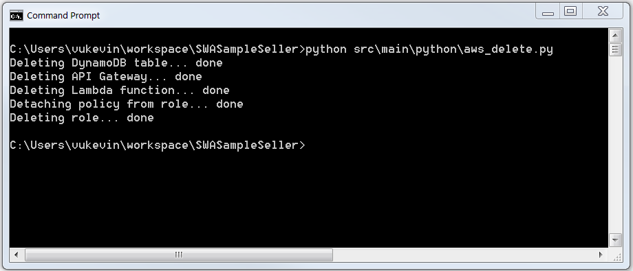

# _WARNING_

* This application is provided for your convenience. Please refer to the SWA Getting Started Guide at https://s3-us-west-2.amazonaws.com/swa-public-documents/integration-guides for detailed information.
* Deploy Sample Seller only to your local machine.
* Anyone who visits this web application will have access to confidential data about your seller account.

# Subscribe with Amazon (SWA) Sample Seller

Sample Seller is a sample web application storefront that uses LWA and SWA APIs.

## Before you start

* This README will refer to the SWA Getting Started Guide at https://s3-us-west-2.amazonaws.com/swa-public-documents/integration-guides/SWA_SellerIntegrationGuide.pdf. For example, **_[4.1.1]_** refers to section 4.1.1 in the guide.
* `path/to/repo` represents the root directory of the Sample Seller repository you've downloaded. `README.md` is in the root directory.

## Install dependencies

1. Install Java Development Kit (JDK) 8.
2. Verify installation by running `javac` from your terminal.
3. Install Apache Maven.
4. Verify installation by running `mvn` from your terminal.

## Edit `src/main/resources/config.json`

1. In `src/main/resources/config.json`
   * Retrieve your **Client ID** and **Client Secret Key** from the **Technical Details** of your product.
     * Set `clientId` to your client ID.
     * Set `clientSecret` to your client secret.
   * Set `detailPageUrl` to the URL for the detail page of your product.
   * Set `port` to an open port you want to serve Sample Seller on.
     * Ex: `8444`
   * Set `redirectUri` to `https://127.0.0.1:port/login`
     * Ex: `https://127.0.0.1:8444/login`
     * In Sample Seller, we want LWA to redirect the user to the `/login` path so Sample Seller can query and display the user's subscriptions information.
   * Set `logoutRedirectUri` to `https://127.0.0.1:port`.
     * Ex: `https://127.0.0.1:8444`
     * In Sample Seller, we want to redirect the user to the landing page.
2. Configure your LWA application. **_[2.4]_**
   * Sign into the App Console at http://login.amazon.com/manageApps.
   * Select the LWA application associated with your SWA subscription.
   * Expand the "Web Settings" tab.
   * Add `https://127.0.0.1:port` to "Allowed JavaScript Origins"
     * Ex: `https://127.0.0.1:8444`
   * Add `redirectUri` to "Allowed Return URLs".
     * Ex: `https://127.0.0.1:8444/login`

## Build Sample Seller

```
cd path/to/repo    # Switch to the repo root directory.
mvn package        # Build the program with Maven.
```

## Run Sample Seller

1. Run the JAR file to start the web application:

```
cd path/to/repo                                         # Switch to the repo root directory.
java -jar target/swa_sample_seller-1.0-SNAPSHOT.jar     # Run the JAR file.
```

2. Visit the application at `https://127.0.0.1:port`

## Take a tour of Sample Seller

1. Visit the index page at [https://127.0.0.1:port](https://127.0.0.1:port).
   * Ex: [https://127.0.0.1:8444](https://127.0.0.1:8444)
2. _[Optional]_ Visit `detailPageUrl` and purchase a subscription.
3. Click the LWA button and sign in with any Amazon account.
4. Check out the dump of API requests/responses on the current page.
    * If you logged in with an account that has purchased a subscription, then you should see a non-empty subscriptions response.
    * If not, then you should see an empty subscriptions response.

## View code snippets

* View code for the LWA button with `view-source:https://127.0.0.1:port` **_[3.1]_**
   * Ex: `view-source:https://127.0.0.1:8444`
* View code for making the API requests:
    * In `src/main/java/com/github/amznlabs/swa_sample_seller/controllers/helpers/AmazonApiHelpers.java`
      * Customer profile 
        * See `// REQUEST CUSTOMER PROFILE`
        * **_[4.1.1, Step 3]_**
      * Security API
        * See `// REQUEST SELLER ACCESS TOKEN`
        * **_[4.2.1]_**
      * Subscriptions API
        * See `// REQUEST SUBSCRIPTIONS`
        * **_[4.1.1, Step 3]_**, **_[4.2.5]_**
* View code for handling SWA API response codes **_[4.2.3]_**:
   * In `src/main/java/com/github/amznlabs/swa_sample_seller/controllers/RequestController.java`
     * See `// HANDLE SWA API RESPONSE CODE`
* View code for parsing an List Subscriptions API request **_[4.2.5]_**:
    * In `src/main/java/com/github/amznlabs/swa_sample_seller/controllers/RequestController.java`
      * See `parseSubscriptionsResponse()`

# SWA Sample Push Notification Endpoint

Sample Push Notification Endpoint is a collection of services running on Amazon Web Services (AWS) that implement an endpoint to catch SWA push notifications.

You **do not** have to use AWS to implement your endpoint. See the FAQ section for more information.

## Setup Python and AWS

1. Install Python 2.7 from https://www.python.org/downloads/
2. Verify your installation by running `python` and `pip` from your terminal.
3. Install the Python `boto3` library: 

```
pip install boto3
```

## Setup AWS

1. Create an AWS account at https://aws.amazon.com/
2. Create an IAM user named `swa_sample_seller` with the `AdministratorAccess` permission.
  * See http://docs.aws.amazon.com/lambda/latest/dg/setting-up.html
  * **Make note of your access key ID and access key secret.**

## Edit `src/main/resources/config.json`

1. Set `awsAccessKeyId` to your user's access key ID.
2. Set `awsSecretAccessKey` to your user's secret access key.
3. _[Optional]_ Change `awsResourcesName` to a name of your choice.
    * Ex: `sample_seller_resources`
    * All AWS resources will be created with this name.
    * Use a name that will be easy to find in your AWS console.
4. _[Optional]_ Change `awsRegionName`
    * See http://docs.aws.amazon.com/AWSEC2/latest/UserGuide/using-regions-availability-zones.html

## Create a sample endpoint to catch push notifications

1. Run: 

```
cd path/to/repo
python src/main/python/aws_create.py
```

2. Make note of the endpoint printed out by the script.
    * Ex: `Your push notification endpoint is YOUR_ENDPOINT`


## Send a test notification **_[4.2.5]_**
1. Visit https://sellercentral.amazon.com/swa/dashboard.
2. Edit the **Technical Details** of your product.
3. Continue to the **Push Notifications** page.
4. Set the **Enter your HTTPS endpoint** field to `YOUR_ENDPOINT`
5. Click **Send Test Notification**.

## View the test notification

1. In your DynamoDB dashboard, view the **Table** with the name of your `awsResourcesName` field.
2. View the **Items** of the table.
3. Verify that there is an entry for the test push notification you just sent.

## View a real push notification

1. Purchase / Renew / Cancel your subscription.
2. View the table in your DynamoDB dashboard.

## Delete your sample endpoint

Run:

```
cd path/to/repo
python src/main/python/aws_delete.py
```



## View code snippets

* Read the comments in `src/main/python/aws_create.py` for a better understanding what AWS services will be setup.
* Read `src/main/python/lambda_function_template.py` for code that processes a push notification.

# FAQ

* Is the AWS usage free?
  * See https://aws.amazon.com/free/ for details on AWS Free Tier.
  * See the pricing pages of the individual AWS services.
* Why can't Sample Seller receive real push notifications?
  * Amazon only sends push notifications to a **publicly accessible IP** that serves a **trusted SSL certificate**.
  * Sample Seller should not be deployed to a publicly accessible IP.
  * Sample Seller uses a self-signed SSL certificate.
* Do I need to use AWS to receive push notifications?
  * You do not need to use AWS.
  * You can use any service that serves a publicly accessible IP with a trusted SSL certificate.
  * See `src/main/python/lambda_function.py` for code to process a push notification.
* What SSL certificates are trusted by Amazon's push notification sender?
  * See https://docs.aws.amazon.com/sns/latest/dg/SendMessageToHttp.https.ca.html.
